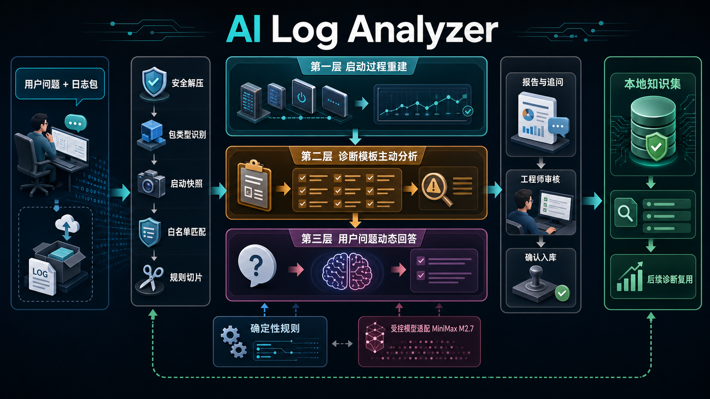

# AI Log Analyzer

AI Log Analyzer is an MVP for communication board log investigation. It will
reconstruct recent boot processes from scattered logs, classify boot outcomes,
and support AI-assisted diagnosis with evidence-backed follow-up answers.

## Feature Panorama



## Backend

Install the backend in editable mode with development dependencies:

```powershell
cd backend
python -m pip install -e ".[dev]"
```

Run the API server:

```powershell
cd backend
python -m uvicorn app.main:app --reload
```

Health check:

```powershell
Invoke-RestMethod http://127.0.0.1:8000/health
```

### Model Provider

The automated test and local MVP path use the deterministic fake provider by
default:

```powershell
$env:AI_LOG_ANALYZER_MODEL_PROVIDER = "fake"
```

To configure MiniMax for a manual integration environment, set:

```powershell
$env:AI_LOG_ANALYZER_MODEL_PROVIDER = "minimax"
$env:AI_LOG_ANALYZER_MINIMAX_API_KEY = "<your-api-key>"
$env:AI_LOG_ANALYZER_MINIMAX_BASE_URL = "https://api.minimax.chat/v1"
$env:AI_LOG_ANALYZER_MINIMAX_MODEL = "MiniMax-M2.7"
```

Run backend tests:

```powershell
cd backend
python -m pytest
```

## Frontend

```powershell
cd frontend
npm install
npm run dev
```

The frontend dev server listens on Vite's printed local URL, usually
`http://127.0.0.1:5173`.

Run frontend tests:

```powershell
cd frontend
npm test -- --run
```

Build the production frontend:

```powershell
cd frontend
npm run build
```

## Demo Log Upload

The repository includes a small demo fixture under
`backend/tests/fixtures/demo_logs/snapshot_0`. It simulates an upgrade booting
from the wrong region, kernel driver probe failure, userspace not reaching the
ready target, and watchdog reset evidence.

Create a demo zip package:

```powershell
Compress-Archive -Path backend/tests/fixtures/demo_logs/snapshot_0/* -DestinationPath demo_logs.zip -Force
```

With the backend running, upload it:

```powershell
curl.exe -X POST "http://127.0.0.1:8000/api/tasks" `
  -F "question=Why did the board fail to boot normally after upgrade?" `
  -F "archive=@demo_logs.zip;type=application/zip"
```

## Full Verification

Run the complete MVP verification set:

```powershell
cd backend
python -m pytest -v
cd ..\frontend
npm test -- --run
npm run build
```
